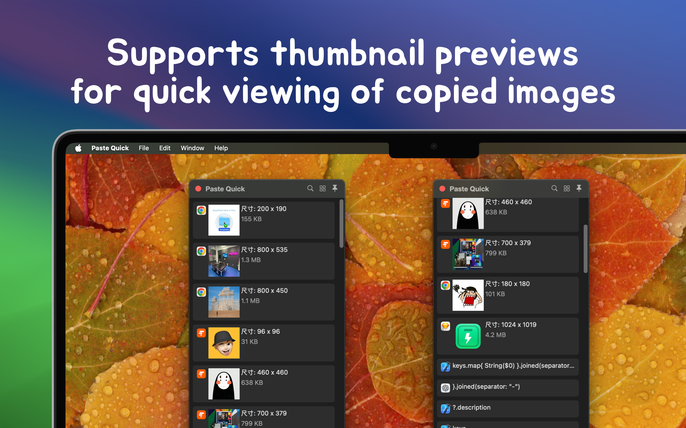

   
   
  
  <h1>Paste Quick</h1>
  <!--rehype:style=border: 0;-->
  

    <a href="./README.zh.md">中文</a> • 
    <a target="_blank" href="https://github.com/jaywcjlove/paste-quick/issues/new?template=bug_report.yml">Contact & Support</a> • 
    <a href="./CHANGELOG.md">Changelog</a>
  

  

    
  

minimum OS requirement: `macOS 14.0`

PasteQuick is a privacy-focused and simple clipboard management tool designed to help you efficiently manage various temporary data such as text, links, images, and code. It records everything you copy or cut and saves it in a history list, allowing you to quickly find and use clipboard records, greatly improving your productivity.

- **Privacy Protection**: All clipboard history is stored locally on your device, with support for excluding specific applications from being recorded, ensuring data security and privacy.
- **Multimedia Preview**: PasteQuick supports image thumbnail previews, allowing you to easily and quickly view copied images.
- **Customization Options**: The tool offers customizable list display options, allowing you to hide or show content based on your needs, fitting different usage scenarios.

PasteQuick is continuously being optimized and developed to bring more convenience to your daily work. We welcome your valuable feedback and suggestions!

<!--idoc:config:
site: Paste Quick
title: A privacy-focused and simple clipboard management tool that efficiently handles various types of temporary data, including text, links, images, and code.
keywords: PasteQuick, clipboard manager, privacy tool, data management, text management, image management, link management, code snippet manager, macOS app
-->