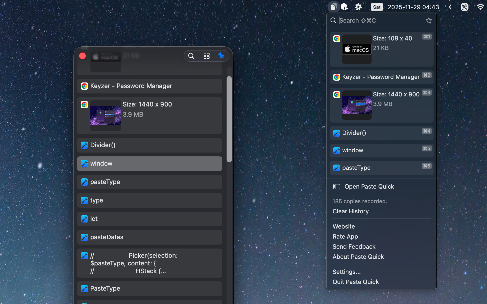
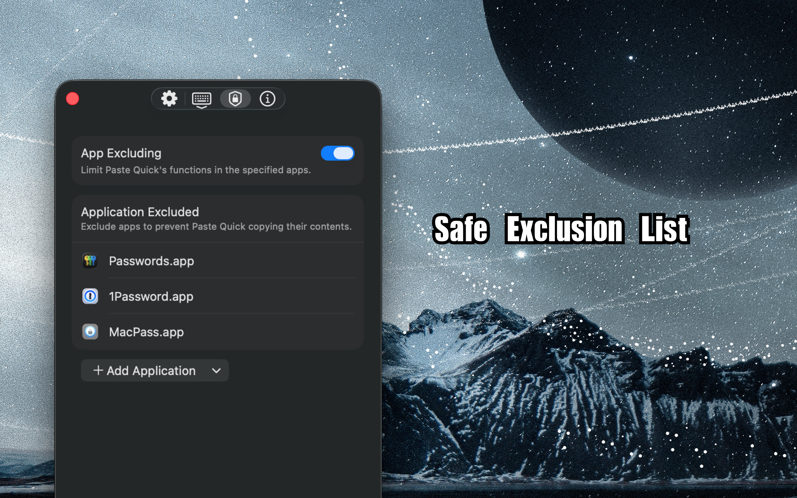
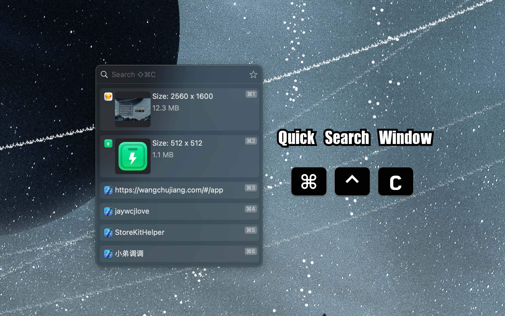
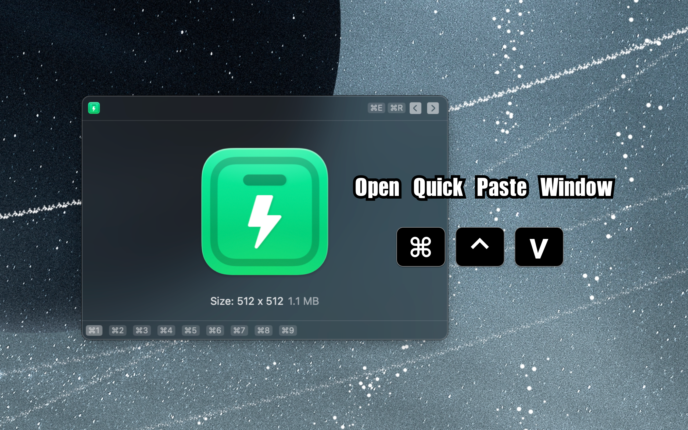

<div align="center">
  <br />
  <br />
  
  <h1>Paste Quick</h1>
  <!--rehype:style=border: 0;-->
  <p>
    <a href="./README.md">English</a> • 
    <a target="_blank" href="https://github.com/jaywcjlove/paste-quick/issues/new?template=bug_report_cn.yml">联系&支持</a> • 
    <a href="./CHANGELOG.zh.md">更新日志</a>
  </p>
  <p>
    <a target="_blank" href="https://apps.apple.com/app/paste-quick/6723903021" title="PasteQuick for macOS">
      
    </a>
  </p>
</div>

<div align="center">

最低操作系统要求：`macOS 14.0`

</div>

PasteQuick 是一款注重隐私与简洁的剪贴板管理工具，帮助你高效管理各种临时数据，如文本、链接、图片和代码。它能够记录你复制或剪切的所有内容，并保存到历史列表中，让你快速查找并使用剪贴板记录，从而显著提升工作效率。





- 隐私保护：所有剪贴板历史记录仅存储在本地设备上，支持排除特定应用的记录，确保数据安全，隐私无忧。
- 多媒体预览：支持图片缩略图预览功能，让你轻松快速查看已复制的图片内容。
- 个性化设置：支持列表显示的自定义选项，可以根据需要隐藏或显示特定内容，满足不同场景的使用需求。





PasteQuick 正在不断优化开发中，期待为你的工作带来更多便利。欢迎提供宝贵的反馈与建议！

## AI 直连剪贴板

PasteQuick 基于 Model Context Protocol（MCP），允许 AI 直接访问剪贴板。

支持 AI 检索、读取、总结、分析剪贴板内容，快速构建自定义 AI 工作流。你的剪贴板数据，赋能 AI。

### 在 Grok 中配置

```bash
# 添加 PasteQuick MCP 服务器
$ grok mcp add pastequick \
  --transport stdio \
  --scope user \
  -- "/System/Applications/PasteQuick.app/Contents/MacOS/PasteQuick" --mcp
# 移除 PasteQuick MCP 服务器
$ grok mcp remove pastequick
# 列出已配置的 MCP 服务器
$ grok mcp list
# 诊断 PasteQuick MCP 服务器的连接状态
$ grok mcp doctor pastequick
```

直接在配置(`vim ~/.grok/config.toml`)中配置：

```ini
[mcp_servers.pastequick]
command = "/Applications/PasteQuick.app/Contents/MacOS/PasteQuick"
args = ["--mcp"]
enabled = true
```

<!--idoc:config:
site: Paste Quick
title: 一款注重隐私的简单剪贴板管理工具，能够高效处理各种临时数据类型，包括文本、链接、图片和代码。
keywords: PasteQuick, 剪贴板管理器, 隐私工具, 数据管理, 文本管理, 图片管理, 链接管理, 代码片段管理, macOS 应用
-->
