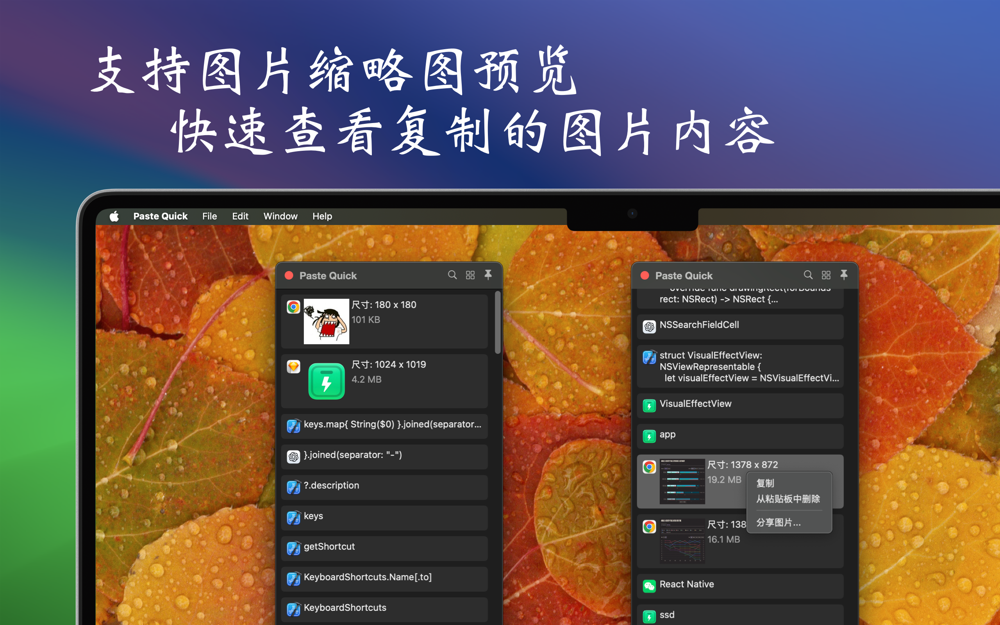
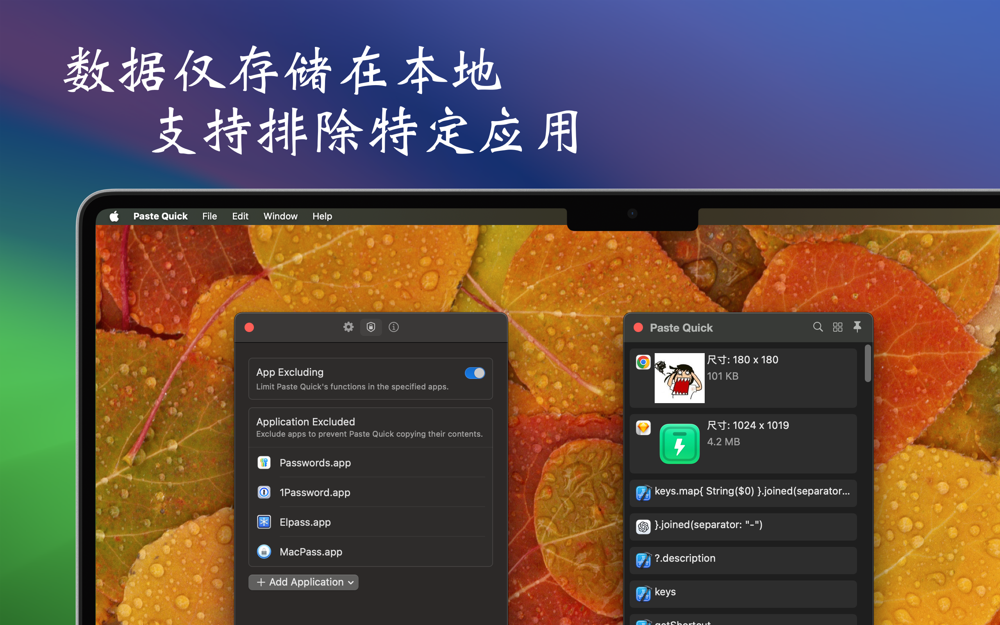

   
   
  
  <h1>Paste Quick</h1>
  <!--rehype:style=border: 0;-->
  

    <a href="./README.md">English</a> • 
    <a target="_blank" href="https://github.com/jaywcjlove/paste-quick/issues/new?assignees=jaywcjlove&labels=support%2Cfeedback%2Cquestion&projects=&template=bug_report_cn.yml&title=%F0%9F%99%8B%E2%80%8D%E2%99%82%EF%B8%8F+%E6%94%AF%E6%8C%81%E4%B8%8E%E5%8F%8D%E9%A6%88%3A+Paste+Quick">联系&支持</a> • 
    <a href="https://github.com/jaywcjlove/paste-quick/releases">变更日志</a>
  

  

    
  

最低操作系统要求：`macOS 14.0`

PasteQuick 是一款注重隐私与简洁的剪贴板管理工具，帮助你高效管理各种临时数据，如文本、链接、图片和代码。它能够记录你复制或剪切的所有内容，并保存到历史列表中，让你快速查找并使用剪贴板记录，从而显著提升工作效率。

- 隐私保护：所有剪贴板历史记录仅存储在本地设备上，支持排除特定应用的记录，确保数据安全，隐私无忧。
- 多媒体预览：支持图片缩略图预览功能，让你轻松快速查看已复制的图片内容。
- 个性化设置：支持列表显示的自定义选项，可以根据需要隐藏或显示特定内容，满足不同场景的使用需求。

PasteQuick 正在不断优化开发中，期待为你的工作带来更多便利。欢迎提供宝贵的反馈与建议！

<!--idoc:config:
site: Paste Quick
title: 一款注重隐私的简单剪贴板管理工具，能够高效处理各种临时数据类型，包括文本、链接、图片和代码。
keywords: PasteQuick, 剪贴板管理器, 隐私工具, 数据管理, 文本管理, 图片管理, 链接管理, 代码片段管理, macOS 应用
-->